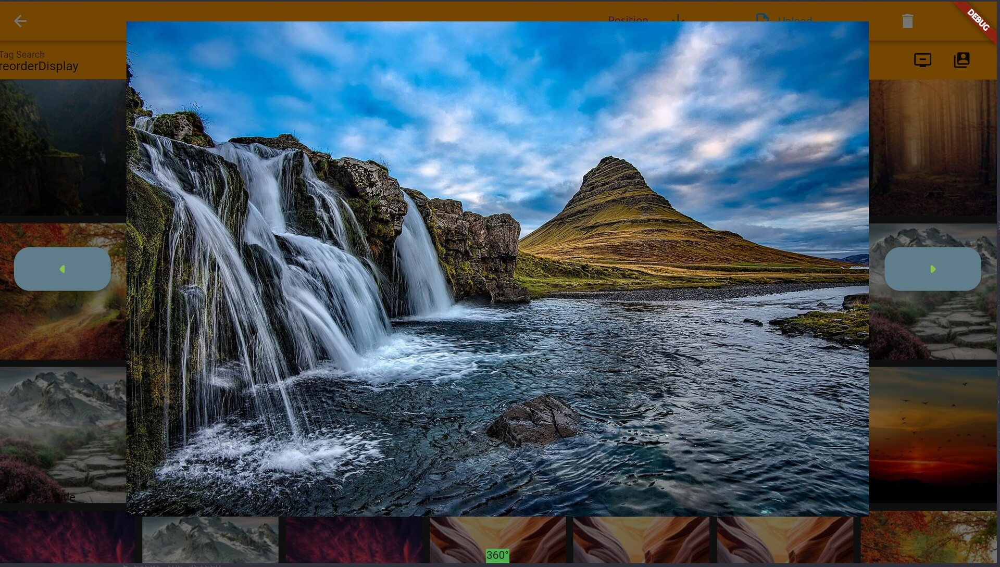
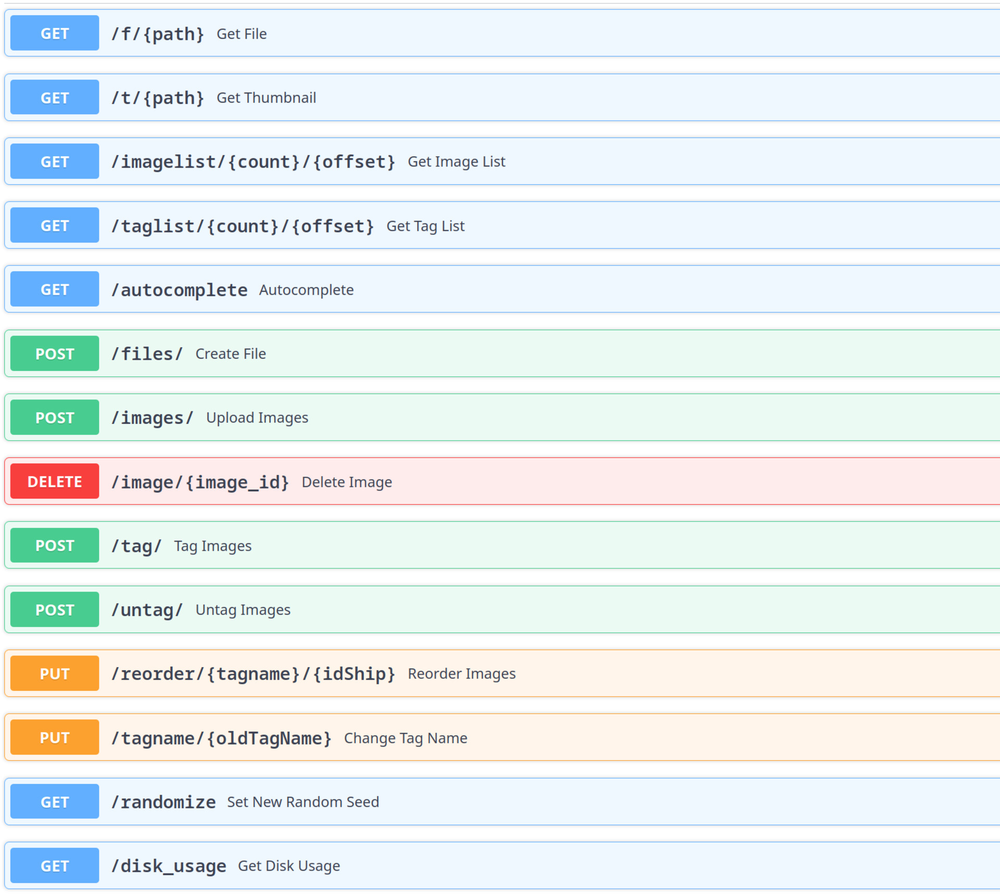

# Image Gallery using Flutter, fastapi and MySQL

## About

|                       App                       |                      Image View                       |
| :---------------------------------------------: | :---------------------------------------------------: |
|        |  |
|  |            Also see [SQL Tables](init.sql)            |

This is a reduced version out of an image gallery server I made to learn SQL, fastapi and flutter. You can upload many images quickly and reorder/tag/untag/delete them with the buttons right from the search bar. On the backend side each Image gets cut a small thumbnail for display in a TileGrid and gets a UUID which gets saved in the image Table. For adding tags there is a tag table and for connecting these two there is an extra tagmap table.

## Getting Started

### Flutter

Flutter handles most stuff on its own just run 

```Bash
flutter pub get
```

in the frontend folder.

### Python

go to the backend folder create a venv and run

```Python
pip install -r requirements.txt 
```

enter your Database/MySQL password in a .env file in the backend folder like DB_PASSWORD=...

then you can run uvicorn main:app

### MySQL

login to your database e.g. with mysql -u root -p and run

```
source absolute/path/to/init.sql
```

## Libaries used

### Flutter

* [photo_view](https://pub.dev/packages/photo_view)
* [file_picker](https://pub.dev/packages/file_picker)
* [http](https://pub.dev/packages/http)
* [dio](https://pub.dev/packages/dio)
* [panorama](https://pub.dev/packages/panorama)
* [flutter_typeahead](https://pub.dev/packages/flutter_typeahead)

### Python

* [fastapi](https://fastapi.tiangolo.com/)
* see [requirements](backend/requirements.txt) for all

